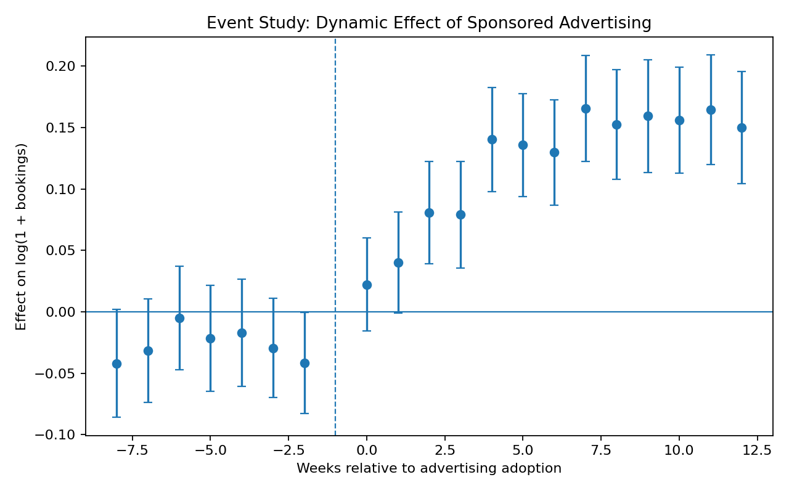

# Marketplace Causal Inference

### Measuring the Incremental Impact of Sponsored Advertising in a Two-Sided Marketplace

This project demonstrates an end-to-end causal inference workflow for evaluating a sponsored advertising program in a two-sided marketplace.

The central business question is simple:

> **Does sponsored advertising actually cause incremental bookings and revenue, or do advertisers simply perform better because stronger suppliers are more likely to advertise?**

The project uses a synthetic marketplace panel with endogenous and staggered advertising adoption to illustrate how causal inference can turn observational marketplace data into actionable business decisions.

---

## Business Problem

Suppose a marketplace allows suppliers—such as hotels, hosts, or merchants—to purchase sponsored placement.

A simple comparison might show that advertisers receive more bookings than non-advertisers.

But this does **not** imply that advertising caused those additional bookings.

Suppliers choose whether and when to advertise. Adoption may depend on:

- recent demand trends,
- supplier quality,
- baseline marketplace visibility,
- expected future performance.

This creates **selection bias and treatment endogeneity**.

The decision problem is therefore not:

> Do advertisers have more bookings?

It is:

> **How many bookings would these same suppliers have received if they had not advertised?**

That counterfactual is the focus of this project.

---

## Data

The analysis uses a fully synthetic weekly marketplace panel designed to reproduce realistic challenges in observational marketplace measurement.

### Sample

- **500 suppliers**
- **52 weeks**
- **26,000 property-week observations**
- Approximately **59.8%** of suppliers eventually adopt sponsored advertising
- Treatment adoption occurs at different times across suppliers

The simulated data include:

- supplier ID
- week
- advertising status
- adoption week
- impressions
- clicks
- bookings
- revenue
- supplier quality
- baseline visibility
- recent demand growth
- true simulated treatment effect

Because the data-generating process is known, estimated causal effects can also be compared with the underlying simulated effect.

---

## Why Naive Measurement Fails

In the synthetic marketplace, advertising adoption is intentionally endogenous.

Suppliers with different quality, visibility, and recent demand trajectories have different probabilities of entering the advertising program.

A raw comparison shows that treated supplier-weeks have approximately **22% more bookings** than untreated supplier-weeks.

However, this difference combines:

1. the causal effect of advertising, and
2. pre-existing differences between suppliers that choose to advertise and those that do not.

Using the raw 22% difference as the incremental impact of advertising would therefore overstate the program's causal contribution.

---

## Identification Strategy

The analysis uses panel variation in treatment timing to separate advertising effects from persistent supplier differences and common marketplace shocks.

The baseline specification is:

\[
\log(1 + Bookings_{it})
=
\alpha_i
+
\gamma_t
+
\beta Advertising_{it}
+
\epsilon_{it}
\]

where:

- \( \alpha_i \) = supplier fixed effects
- \( \gamma_t \) = week fixed effects
- \( Advertising_{it} \) = treatment status
- \( \beta \) = estimated incremental effect of advertising

Standard errors are clustered at the supplier level.

The project then extends the analysis using an **event-study design** to examine treatment dynamics and pre-treatment trends.

---

## Main Result

The naive treated-versus-untreated comparison suggests approximately:

**22% higher bookings**

for treated observations.

After controlling for supplier and week fixed effects, the estimated incremental effect is approximately:

### **15.45% increase in bookings**

This distinction is economically important.

The raw performance gap would attribute both selection and causal impact to the advertising program. The causal model produces a more defensible estimate of incrementality.

---

## Event Study

The event study examines booking behavior before and after advertising adoption.



The estimates show relatively limited pre-treatment differences followed by a clear post-adoption increase in bookings.

The treatment effect builds over the first several weeks and then stabilizes, consistent with a gradual advertising exposure response.

Selected dynamic estimates:

| Week Relative to Adoption | Log Booking Effect |
|---:|---:|
| -6 | -0.005 |
| -4 | -0.017 |
| -2 | -0.042 |
| 0 | 0.022 |
| +2 | 0.081 |
| +4 | 0.140 |
| +8 | 0.153 |
| +12 | 0.150 |

The dynamic pattern provides information that a single average treatment effect cannot: **when the effect appears and whether it persists.**

---

## Heterogeneous Treatment Effects

Average treatment effects can hide economically meaningful differences across suppliers.

The project therefore examines treatment effects by baseline marketplace visibility.

This addresses a practical product question:

> **Should sponsored advertising be promoted broadly, or targeted toward suppliers for whom additional exposure creates the greatest incremental value?**

The results suggest meaningful heterogeneity across visibility segments, reinforcing the importance of targeting rather than relying only on an overall average effect.

---

## Business Recommendation

The analysis supports three conclusions.

**1. Do not evaluate advertising using treated-versus-untreated averages.**

Supplier self-selection creates substantial bias in naive marketplace comparisons.

**2. Sponsored advertising appears to generate meaningful incremental bookings.**

The fixed-effects estimate implies an average booking increase of approximately **15.5%**, substantially below the raw 22% performance difference but still economically meaningful.

**3. Optimize the program using heterogeneous incrementality.**

Rather than maximizing advertising enrollment alone, the marketplace should identify suppliers whose bookings are most responsive to incremental visibility.

This shifts the business objective from:

**Who is most likely to advertise?**

to:

**For whom does advertising create the most incremental marketplace value?**

---

## Methods Demonstrated

### Causal Inference

- Panel data methods
- Two-way fixed effects
- Event-study estimation
- Staggered treatment adoption
- Pre-trend diagnostics
- Heterogeneous treatment effects
- Clustered standard errors
- Counterfactual reasoning

### Data Science

- Python
- pandas
- NumPy
- statsmodels
- matplotlib
- reproducible synthetic data generation

### Analytics Engineering

- SQL marketplace metrics
- modular Python code
- automated tests
- reproducible model outputs
- version-controlled analysis

### Business Analytics

- marketplace incrementality
- advertising effectiveness
- supplier segmentation
- targeting strategy
- translating econometric estimates into product decisions

---

## Repository Structure

```text
marketplace-causal-inference/
│
├── README.md
├── requirements.txt
│
├── src/
│   ├── generate_data.py
│   ├── analysis.py
│   └── plotting.py
│
├── notebooks/
│   └── marketplace_causal_analysis.ipynb
│
├── sql/
│   └── marketplace_metrics.sql
│
├── tests/
│   └── test_data_generation.py
│
└── results/
    ├── event_study.png
    ├── event_study.csv
    ├── heterogeneous_effects.csv
    └── model_summary.csv
```

---

## Reproducing the Analysis

Clone the repository and install the required packages:

```bash
pip install -r requirements.txt
```

Generate the synthetic marketplace panel:

```bash
python src/generate_data.py
```

Run the causal analysis:

```bash
python src/analysis.py
```

Generate the event-study visualization:

```bash
python src/plotting.py
```

---

## Key Takeaway

**Correlation measures who performs better. Causal inference measures what the marketplace actually caused.**

In marketplace settings with voluntary program adoption, that distinction can materially change product strategy, targeting decisions, and estimates of incremental value.

---

## About This Project

This is an independent portfolio project using **fully synthetic data**.

It does not contain proprietary, confidential, or company-specific data.

The project was designed to demonstrate how econometric and causal inference methods can be applied to real-world marketplace and product decisions.
